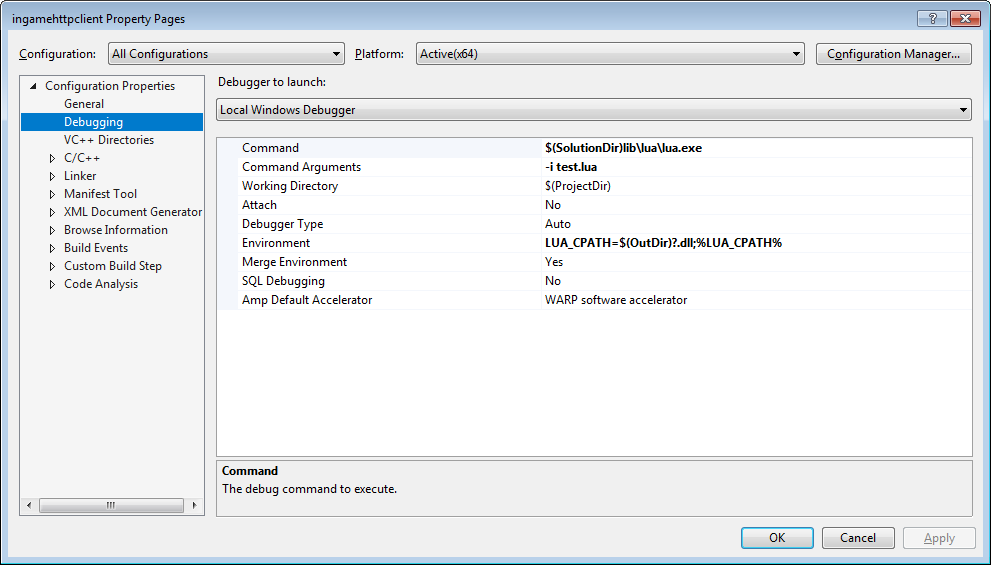

# In-game Lua HTTP library

A tiny HTTP client library that could be used as a part of the any game that supports Lua 5.3 scripting. It consists of just one DLL file ~~and supports domain whitelisting (TODO)~~.

If you do not need a minimal API surface and the number of files is not an issue, then another library such as [luasocket](https://github.com/diegonehab/luasocket) would most likely be a better choice.

# Building

## On Windows

You may use different directories than described here, but then you will need to edit project settings.

## Lua setup

Compile Lua 5.3.x as described [here](https://blog.spreendigital.de/2015/01/16/how-to-compile-lua-5-3-0-for-windows/). Make sure that a 64-bit compiler is used. Place the sources in `C:\Lua53\src` and the compiled binaries in `C:\Lua53\bin`.

## POCO setup
In `C:\Dev` run:
* `git clone --single-branch -b poco-1.9.0 https://github.com/pocoproject/poco.git` (the version on the official website is missing NetSSL_Win sources)
* `cd poco`
* `write components` and change it to:
```
Foundation
Net
NetSSL_Win
```
* `"C:\Program Files (x86)\Microsoft Visual Studio 14.0\VC\vcvarsall.bat" amd64` (assuming that VS2015 is installed, otherwise the path and the batch file name will be different)
* `buildwin 140 build all both x64 nosamples`

## On Linux or Mac

Not supported at the moment, but it would require minimal code changes. NetSSL_OpenSSL would be used instead of NetSSL_Win.

# Debugging

Debug build uses `OutputDebugString` for logging. This output can be viewed with [DebugView](https://docs.microsoft.com/en-us/sysinternals/downloads/debugview).

It is recommended to set project's debugging settings as follows:



This will run a test script and leave an interactive Lua prompt open.
